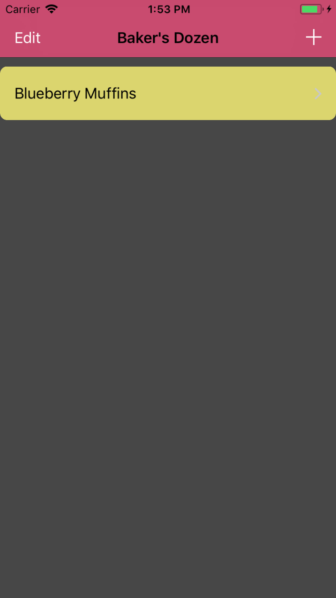

# Baker's Dozen
Baker’s Dozen is a recipe management application designed for people who enjoy cooking and baking, and like to create, edit, and share recipes that they’ve made.

Jüri Kiin

# Features:
- User is able to add a recipe
- User can edit a recipe
- User can view a recipe
- User can share details of their recipe on social media
- User can delete a recipe
- User is able to enter a MakeRecipe view to swipe through the steps of that recipe
- The ingredients for each step are listed in that MakeRecipeView

# Screenshots:
1. Main Menu

2. Adding a recipe

3. Editing a recipe

4. Viewing a recipe

5. Making a recipe

